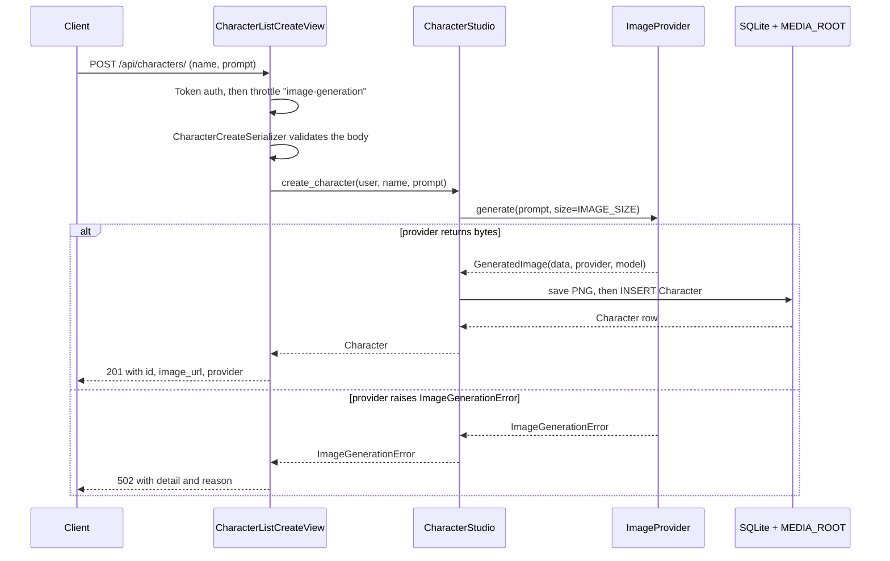

# persona-portrait-api

A small Django/DRF service that turns a sentence about a character into a stored
portrait: POST a name and a prompt, it renders an image, writes it under
`MEDIA_ROOT`, and returns a row you can list, fetch and delete. Generation sits
behind an `ImageProvider` interface with two implementations — OpenAI, and a
deterministic offline renderer that is the default — so a fresh clone and
`manage.py test` need no API key and no network.

## One request, one portrait

```bash
pip install -r requirements.txt
python manage.py migrate
python manage.py createsuperuser
python manage.py runserver 7171
```

```bash
TOKEN=$(curl -s -X POST http://127.0.0.1:7171/api/auth/token/ \
  -H 'Content-Type: application/json' \
  -d '{"username":"ada","password":"portrait-pass-123"}' | python -c 'import sys,json;print(json.load(sys.stdin)["token"])')

curl -s -X POST http://127.0.0.1:7171/api/characters/ \
  -H "Authorization: Token $TOKEN" -H 'Content-Type: application/json' \
  -d '{"name":"Captain Vale","prompt":"a weathered sea captain with a silver beard"}'
```

```json
{"id":1,"name":"Captain Vale","prompt":"a weathered sea captain with a silver beard",
 "image_url":"http://127.0.0.1:7171/media/character_images/captain-vale-dbee99a13d2a.png",
 "provider":"local","image_model":"local-identicon-v1","owner":"ada","created_at":"2026-09-28T06:34:40.359029Z"}
```

`GET` that `image_url` and you get a 4733-byte PNG. Drop `prompt` and you get
`400 {"prompt":["This field is required."]}`; drop the token and you get `401`.

## No key, no problem

`IMAGE_PROVIDER` picks the backend. With no `OPENAI_API_KEY` it resolves to
`local`, which derives a symmetric colour field from the SHA-256 of the prompt —
same prompt in, byte-identical PNG out, which is what the tests assert against.
Set `OPENAI_API_KEY` and the default flips to `openai`: `client.images.generate`
with `OPENAI_IMAGE_MODEL` (default `gpt-image-1`), base64 decoded. Each row records
the provider and model behind it, so mixed data stays traceable.
A third backend is a subclass plus `register("replicate", ReplicateProvider)`.

## What happens between POST and 201



The view never imports a provider or touches the filesystem: it validates, calls
`CharacterStudio`, and maps one exception type to one status code. Missing key,
timeout, undecodable payload all arrive as `ImageGenerationError` — and none of
them leave a half-written row behind.

## Endpoints

| Method | Path | Notes |
|---|---|---|
| `POST` | `/api/auth/token/` | Username + password in, DRF token out. Public. |
| `GET` | `/api/health/` | Status, DB round-trip, active provider. Public. |
| `POST` | `/api/characters/` | Generate. Throttled by `IMAGE_GENERATION_RATE`. |
| `GET` | `/api/characters/` | Own rows, newest first. `?search=`, `?page=`, `?page_size=`. |
| `GET` | `/api/characters/{id}/` | Own rows only; anyone else's is a 404, not a 403. |
| `DELETE` | `/api/characters/{id}/` | Deletes the row and the rendered file. |

Scoping to `request.user` happens in one place (`OwnedCharactersMixin`) and uses
`select_related("user")`, so listing ten characters costs the same two queries as
listing one. A test asserts exactly that.

## Settings

Everything lives in `.env` (see `.env.example`); real environment variables win.
Nothing is hard-coded except a development `SECRET_KEY` the app refuses to use once
`DJANGO_DEBUG` is off — it raises on startup instead. Knobs: `IMAGE_PROVIDER`,
`IMAGE_SIZE`, `OPENAI_IMAGE_MODEL`, `OPENAI_TIMEOUT_SECONDS`, `CHARACTER_PAGE_SIZE`,
`IMAGE_GENERATION_RATE`, `DJANGO_DB_PATH`, `DJANGO_MEDIA_ROOT`, `DJANGO_ALLOWED_HOSTS`.

## Tests, lint, containers

```bash
python manage.py test                      # 76 tests, OK
ruff check . && ruff format --check .
docker compose up --build                  # http://localhost:7171
```

The suite covers provider determinism, the OpenAI response mapping (stub client, no
network), storage, auth, validation, ownership scoping, paging, search, throttling
and the 502 path. The image is multi-stage, runs as uid 10001, migrates on start and
serves via gunicorn; compose refuses to start without `DJANGO_SECRET_KEY` and keeps
database plus media on the `portrait-data` volume. **It has not been built or booted
here** — Docker Desktop is off on this machine, so only `docker compose config` ran.

## Known gaps

- SQLite only; `DATABASES` is the one place to change for Postgres, untested.
- Generation is synchronous. A queue returning `202` plus a job id belongs at the
  `CharacterStudio` seam.
- `MEDIA_ROOT` is local disk: no S3, no CDN. Tokens never expire, and users come
  from `manage.py` or the admin — there is no registration endpoint.
